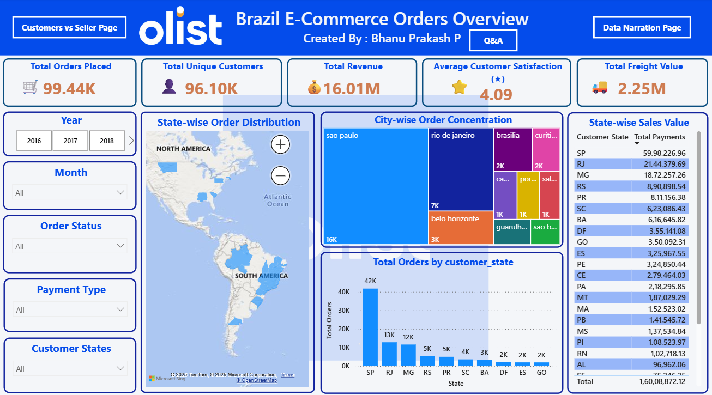
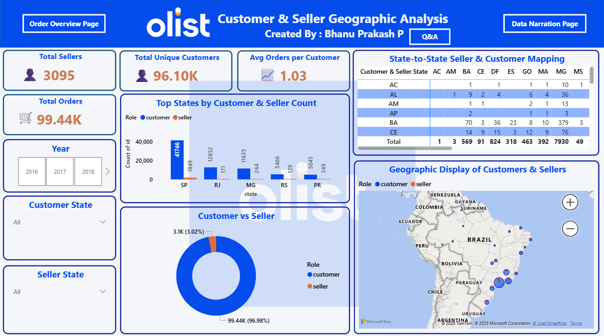

# Olist E-Commerce Sales Dashboard

🚀 **Turned 2M+ e-commerce rows into actionable insights using Power BI + AI + OpenRefine**

This project analyzes the **Olist E-Commerce Kaggle dataset** (millions of real-world Brazilian e-commerce records) and delivers **business-ready insights** through an **interactive 2-page Power BI dashboard**.

---

## 📊 Project Highlights

- **Big Data Handling:** Processed millions of rows using **Power Query** and **star schema modeling**.  
- **Data Cleaning:** Used **OpenRefine** to fix duplicates, inconsistent ZIP codes, and missing values.  
- **AI-Assisted Analytics:** **AI recommended KPIs and DAX formulas** based on business questions.  
- **Interactive Dashboard:** Includes KPIs, maps, treemaps, and drill-down analysis.

---

## 📂 Project Files

- **Dashboard File:** `Olist_Sales_Dashboard.pbix`  
- **Kaggle Raw Dataset:** `/Olist_Raw_Dataset.zip`  
- **Dashboard Screenshots:** `/images/`  

💡 **Note:**  
Cleaned datasets are **not uploaded** to keep the repository lightweight.  
All **data cleaning steps and transformations** can be reviewed **directly in the Power BI file**.

---

## 🖼️ Dashboard Preview

**Page 1: Sales Overview**  

**Page 2: Customer & Seller Analysis**  

---

## 🔹 Key Insights

1️⃣ Sales **concentrated in SP & RJ** → Opportunity to expand into under-served states  
2️⃣ **Low repeat purchase rate (1.03 orders/customer)** → Launch loyalty programs  
3️⃣ **Centralized seller network** → Regional hubs could reduce delivery time & freight cost  

---

## ⚡ Tech Stack

- **Power BI** – Data Modeling & Visualization  
- **OpenRefine** – Data Cleaning & Deduplication  
- **AI in BI** – KPI & DAX Suggestions  
- **Kaggle Dataset** – Olist Brazilian E-Commerce Data  

---

## 💼 About Me

I am a **fresher Data Analyst** passionate about **data storytelling, dashboarding, and business insights**.  
Excited to **connect with professionals** and explore **entry-level Data Analyst roles**!  

**Portfolio:** [YourPortfolio.com](https://bhanu-prakash-protfolio.vercel.app/)  
**LinkedIn:** [YourLinkedIn](https://www.linkedin.com/in/pepala-bhanu-prakash-2002m09d14/)  

---

⭐ **If you find this project helpful, please give it a star on GitHub!**
